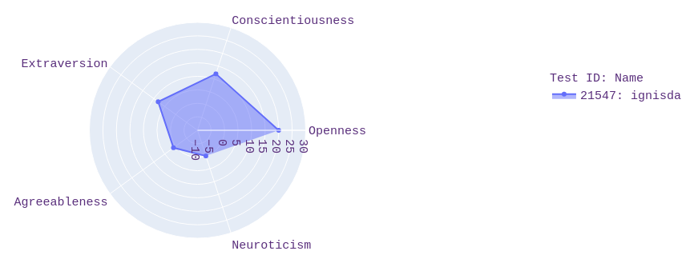
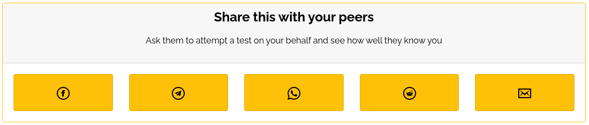
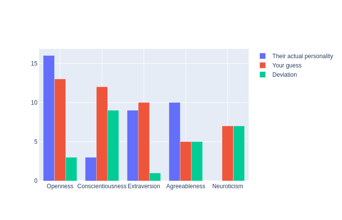
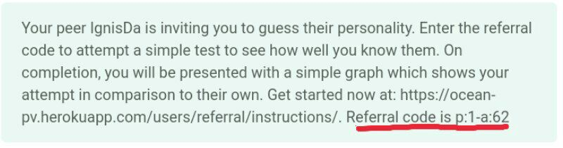

*******************************
OCEAN Personality Visualization
*******************************

.. image:: https://img.shields.io/github/license/IgnisDa/ocean-pv
	:alt: GitHub

.. image:: https://img.shields.io/travis/com/IgnisDa/ocean-pv
    :alt: Travis (.com)

.. image:: https://readthedocs.org/projects/ocean-pv/badge/?version=latest
	:target: https://ocean-pv.readthedocs.io/en/latest/?badge=latest
	:alt: Documentation Status

What this website does
======================

A website to visualize your personality using graphs and compare it 
with others. It asks you a
series of questions and analyzes your inputs to create an easy to understand 
graph. It also provides you an
easy way to share these results with your peers and compare your personalities.
It is based on the 
OCEAN_ personality model which is the most acceptable model to measure 
personality used by researchers. 

.. _OCEAN: https://en.m.wikipedia.org/wiki/Big_Five_personality_traits 

Start using the website
=======================

First Steps
-----------

After you *Register* and *Login*, you're guided to take a small
test and asked some questions. Based on your answers, a graph is
generated. This graph tell you where you stand according to the
OCEAN_ personality model, along with a description of what each
attribute means.

Completing your profile
-----------------------

After completing the test, it's recommended that you complete your
profile and fill in other information about yourself like your `bio`, 
`email`, `country`, `gender` etc. This will help us to categorize
your answers better.

Inviting some peers to the scene
--------------------------------

Peers are anyone you know- family, friends, relatives, co-workers, bosses and
acquaintance. You can ask them to attempt a test and try to guess your
personality. To do this, go to the **Results** page (accessed from the dropdown
option **Discover**) and select a test you would like them to attempt
against.

Under the graph depicting your personality, you will find options to invite
peers to this website using Whatsapp, Telegram, Facebook, email or Reddit. They will
have to **Register** and then **Login** to attempt the test, using the referral
code that came with the message.

Once they have attempted the test, they will be presented with two graphs- the
first one will be an overlay-graph showing their attempt against your actual
personality, while the second one will be a bar-graph showing their accuracy.

Additionally, you will also be notified by email about your peer's attempt to
guess your personality (assuming you updated your email ID in your profile).

Revisit the website any time, click on **Results** in the
**Discover** tab, find the test attempted by your peer and see how well they
know you. You can even attempt a test to try and guess your peer's personality
using the same process of sharing as described above.

Sent here by a peer?
--------------------

So your peer has invited to show how well you know them? You are at the right
place! Simply *Register* with us to get started. Once logged in, click on
**Sent here by a peer?** on the homepage, and then enter the referral code
you received.

Further reading
===============

The code is documented at https://ocean-pv.readthedocs.io/en/latest/
